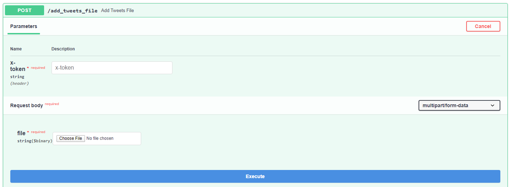

# GPT-2 Twitter Kubernetes

<p align="center">
  <a>
    
  </a>
  <a href="https://github.com/aarongrainer/gpt2-twitter-cloud-run/blob/master/LICENSE">
    
  </a>
</p>

A FastAPI app and python scripts designed to run a [GPT-2](https://openai.com/blog/better-language-models/) powered twitter bot on a schedule using Kubernetes deployment, cronjobs and MongoDB. 

* The newest state-of-the-art GPT-2 language model from OpenAI is trained and fine-tuned on user tweets. 

* Due to the current unpredictibility of AI-generated language models, AI tweets are batch generated and human currated. 

* A centralized Mongodb dataset hosted on kubernetes is used to house the currated tweets.

* FastAPI endpoints are used to populate the database with new generated tweets

* The endpoints and k8 cronjobs are used to tweet out the genereated tweets with a specified user account using Tweepy.

## Installation

```shell
git clone git@github.com:AaronGrainer/gpt2-twitter-kubernetes.git

conda create -n [ENV_NAME] python=3.8

conda activate [ENV_NAME]

pip install -r requirements.txt
```

## Downloading User Tweets

Twitter's API currently limits the users to retrieving only the latest 3,200 tweets from a given user, which is not nearly enough input data for training. Therefore, the python package [twint](https://github.com/twintproject/twint) is used to bypass the API limitation.

To download a list of tweets from any given user, call `download_tweets.py`, For example:

```shell
python -m src.scripts.download_tweets --username=karpathy
```

## Training GPT-2 on User Tweets

Given the downloaded user tweets, the huggingface [Trainer API](https://huggingface.co/transformers/main_classes/trainer.html) is used to train a GPT-2 model to generate tweets based on the tweeting pattern of the user. 

Train the model on the downloaded tweets by calling `trainer.py`, the provided filename should match the tweets file downloaded. For example:

```shell
python -m src.ml.trainer --dataset=data/karpathy_tweets.txt
```

This will train the GPT-2 model and generate an output tweet file that looks like this:

```text
My poor brain. I'm so tempted to plug this in and see if I can't decipher it as a self-supervised basic arithmetic problem. But no, I can't. It's too painful. Too much loss. Something must give. Please, gods above, let this be true.
====================
The 2D appearance of an image can be deceivingly complex. My head may be incomplete, but I assure you it's not incomplete.
====================
While coding, almost everything I write is saved. I don't want this.
====================
Spending extra time tuning my baselines, thinking about how much incentive I have not to, & how this is the reason we can't have nice things
====================
SpaceX Falcon 9 launch in ~20 minutes! + Another attempt at first stage recovery coming   #soexcite
====================
```

You are now able to currate the tweets above, removing an non-funny tweets perhaps? But please do keep the general format intact.

## Environment Variables

1. Create a new .env file using the .env_reference file as reference. Populate the .env file with the desired app settings. This file serves to provide all the environment variables necessary for deploying the app. 

## Setting up Twitter Bot

To populate the .env file and run a Twitter bot, the `CONSUMER_KEY`, `CONSUMER_SECRET`, `ACCESS_KEY` and `ACCESS_SECRET` is required.

1. Create a normal twitter account and apply for a [twitter developer app](https://developer.twitter.com/en).

2. The 4 twitter variables can be obtained within the twitter developer app page.

## Trying the app out Locally / Minikube / Skaffold

To run the app localy, first deploy the kubernetes mongoDB instance the use skaffold to deploy the APP and job.

```python
# Startup local minikube cluster
minikube start
kubectl create namespace gpt2-twitter
kubectl config set-context minikube --namespace=gpt2-twitter
minikube dashboard
```

```python
# Deploy Kubernetes Mongodb and open port-forward for development
kubectl apply -f kubernetes/mongo-volume.yaml
kubectl apply -f kubernetes/mongo.yaml

kubectl port-forward svc/mongo 4321:27017
```

## Populating the server

After MongoDB service is running, visit the [URL]/docs. You will be greeted with [FastAPI's](https://fastapi.tiangolo.com/) automatic interative documentation powered by [Swagger UI](https://github.com/swagger-api/swagger-ui). 



1. Select the `/add_tweets_file/` endpoint, enter the x-token and upload the currated tweets file generated during the model training phase.

2. You can use the connect to the Mongodb port-forwarded endpoint host:port to verify that the database has been populated with the currated tweets.

## Running the tweet job

You can either run the kubernetes Cronjob to schedule a routined tweet, or access the API endpoint `/post_tweet/` to post a tweet.

```python
# Start-up either the FastAPI App container
skaffold dev

# or cronjob container
skaffold dev -f skaffold-post.yaml
```


